# Stringmethods

## What is method in Java Script ?

Method and a function are the same, with different terms.A method is a procedure or function in object-oriented programming. A function is a group of reusable code which can be called anywhere in your programm.

(tajik language)
Усул ва функсия бо истилоҳҳои гуногун якхелаанд,. Усул як тартиб ё функсия дар барномасозии ба объект нигаронидашуда мебошад. Функсия як гурӯҳи кодҳои такрористеъмолшаванда мебошад, ки онро дар ҳама ҷо дар барномаи шумо даъват кардан мумкин аст.

(...)
Усул маҷмӯи амалҳои оқилонаест, ки барои ҳалли мушкилоти мушаххас ё ноил шудан ба ҳадафи мушаххас бояд анҷом дода шаванд.

## Method 1

## Method 2

or

## method 1

## method 2

## Create JavaScript Strings

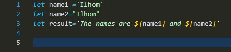

## method charAt()

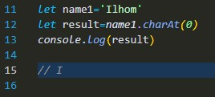

## method concat()

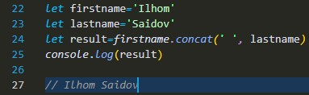

## method replace()

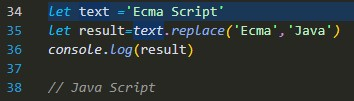

## method split ()

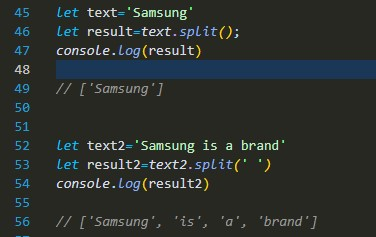

## method substr (start, length)

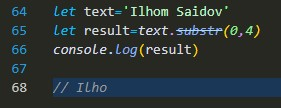

## method substring(start,end)

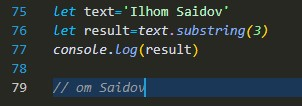

## method slice(start, end)

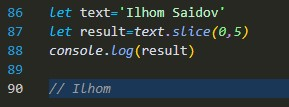

## method toLowerCase() toUpperCase()

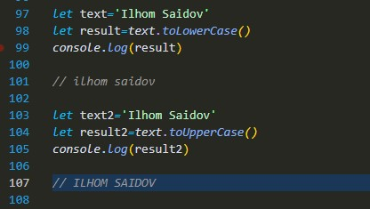

## method trim()

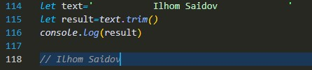

## method includes()

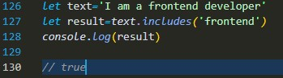

## method search ()

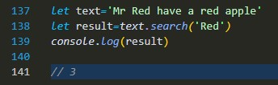

# THANKS FOR ATATION!
